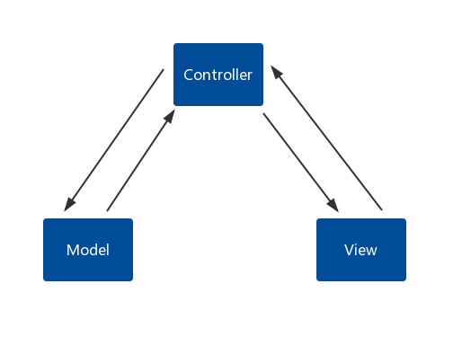
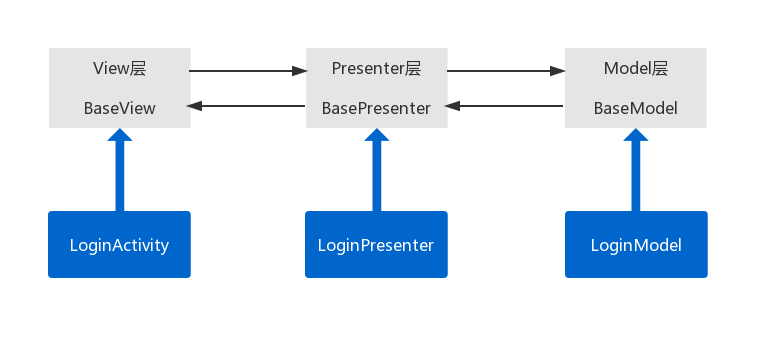

## MVP架构设计



### MVP初探

#### 关系：

- View收到用户的操作（与MVC的区别，Activity是View层）
- View把用户的操作，交给Presenter
- Presenter控制Model进行业务逻辑处理
- Presenter处理完毕后，数据封装到Model
- Presenter收到通知后，在更新View

#### 方式：

是双向的通信方式

#### 优点：

- View层与Model层完全分离
- 所有逻辑交互都在Presenter
- MVP分层较为严谨

### MVP思想精髓

- View层只需面向Presenter层，不需要知道Model层
- Model层只需面向Presenter层，不需要知道View层
- View层和Model层逻辑交互在Presenter

### 巧妙解耦View与Model


### MVP基础框架搭建

以登录模块为例



1. 收到用户请求，给P层
2. 校验请求信息后，操作M层
3. 请求服务器登录业务
4. 把结果数据通知给P层
5. 解析结果数据，处理后给V层
6. 更新UI


基类：

BaseView

```java
public abstract class BaseView<P extends BasePresenter, CONTRACT> extends AppCompatActivity {

    public P presenter;

    @Override
    protected void onCreate(@Nullable Bundle savedInstanceState) {
        super.onCreate(savedInstanceState);

        presenter = getPresenter();
        presenter.bindView(this);
    }

    @Override
    protected void onDestroy() {
        super.onDestroy();
        presenter.unBindView();
    }

    public abstract P getPresenter();
    public abstract CONTRACT getContract();
}
```

BasePresenter

```java
public abstract class BasePresenter<V extends BaseView, M extends BaseModel, CONTRACT> {
    public M m;
    // 绑定View层弱引用
    private WeakReference<V> mWeakReference;

    public BasePresenter() {
        m = getModel();
    }

    public void bindView(V v) {
        mWeakReference = new WeakReference<>(v);
    }

    public void unBindView() {
        if(mWeakReference != null) {
            mWeakReference.clear();
            mWeakReference = null;
            System.gc();
        }
    }

    // 获取View，P -- V
    public V getView() {
        if(mWeakReference != null) {
            return mWeakReference.get();
        }
        return null;
    }

    public abstract M getModel();

    // 获取子类具体契约（Model层和View层协商的共同业务）
    public abstract CONTRACT getContract();
}
```

BaseModel

```java
public abstract class BaseModel<P extends BasePresenter, CONTRACT> {
    public P p;

    public BaseModel(P p) {
        this.p = p;
    }

    public abstract CONTRACT getContract();
}
```

契约类

```java
public interface LoginContract {
    interface IModel {
        // Model层子类完成方法的具体实现 ----------------2
        void doLogin(String name, String password) throws Exception;
    }

    interface IView<T extends BaseBean> {
        // 真实的项目中，请求结果往往是以javabean --------------4
        void handlerResult(T t);
    }

    interface IPresenter<T extends BaseBean> {
        // 登录请求（接收到View层指令，可以自己做，也可以让Model层去执行）-----------1
        void requestLogin(String name, String password);

        // 结果响应（接收到Model层处理的结果，通知View层刷新）---------------3
        void responseResult(T t);
    }
}
```

实现类

LoginActivity

```java
public class LoginActivity extends BaseView<LoginPresenter, LoginContract.IView> {
    private EditText nameEt;
    private EditText pwdEt;

    @Override
    protected void onCreate(Bundle savedInstanceState) {
        super.onCreate(savedInstanceState);
        setContentView(R.layout.activity_login);
        initView();
    }

    // 初始化控件
    private void initView() {
        nameEt = findViewById(R.id.et_name);
        pwdEt = findViewById(R.id.et_pwd);
    }

    @Override
    public LoginPresenter getPresenter() {
        return new LoginPresenter();
    }

    @Override
    public LoginContract.IView getContract() {
        return new LoginContract.IView() {
            @Override
            public void handlerResult(BaseBean baseBean) {
                if (baseBean != null) {
                    Toast.makeText(LoginActivity.this, baseBean.toString(), Toast.LENGTH_SHORT).show();
                } else {
                    Toast.makeText(LoginActivity.this, "登录失败！", Toast.LENGTH_SHORT).show();
                }
            }
        };
    }

    public void doLoginAction(View view) {
        String name = nameEt.getText().toString();
        String pwd = pwdEt.getText().toString();

        // 发起需求，让Presenter处理
        presenter.getContract().requestLogin(name, pwd);
    }
}
```

LoginPresenter

```java
public class LoginPresenter extends BasePresenter<LoginActivity, LoginModel, LoginContract.IPresenter> {
    @Override
    public LoginModel getModel() {
        return new LoginModel(this);
    }

    @Override
    public LoginContract.IPresenter getContract() {
        return new LoginContract.IPresenter() {
            @Override
            public void requestLogin(String name, String password) {
                try {
                    // 三种风格（P层很极端，要么不做事只做转发，要么就是拼命一个人干活）
                    m.getContract().doLogin(name, password);

                    // 第二种，让功能模块去工作（Library：下载、请求、图片加载）
//                    HttpEngine engine = new HttpEngine<>(LoginPresenter.this);
//                    engine.post(name, password);

                    // P层自己处理（谷歌例子）
//                    if ("fhj".equalsIgnoreCase(name) && "123456".equals(password)) {
//                        responseResult(new UserInfoBean("冯慧君", "13655161543"));
//                    } else {
//                        responseResult(null);
//                    }
                } catch (Exception e) {
                    e.printStackTrace();
                }
            }

            @Override
            public void responseResult(BaseBean baseBean) {
                getView().getContract().handlerResult(baseBean);
            }
        };
    }
}
```

LoginModel

```java
public class LoginModel extends BaseModel<LoginPresenter, LoginContract.IModel> {
    public LoginModel(LoginPresenter loginPresenter) {
        super(loginPresenter);
    }

    @Override
    public LoginContract.IModel getContract() {
        return new LoginContract.IModel() {
            @Override
            public void doLogin(String name, String password) throws Exception {
                if ("fhj".equalsIgnoreCase(name) && "123456".equals(password)) {
                    p.getContract().responseResult(new UserInfoBean("冯慧君", "13655161543"));
                } else {
                    p.getContract().responseResult(null);
                }
            }
        };
    }
}
```