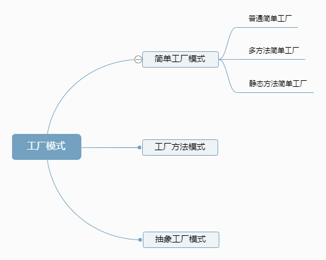

## 设计模式

### 1. 工厂模式



#### 1.1 简单工厂模式

就是建立一个工厂类，对实现了同一接口的一些类进行实例的创建。

核心：提供一个创建对象的功能，不需要关心具体实现

举个获取学校中个人信息

（1）创建获取个人信息共同接口

```java
public interface IPerson {
    PersonBean getPersonInfo();
}
```

（2）教师实现类

```java
public class TeacherImpl implements IPerson {
    @Override
    public PersonBean getPersonInfo() {
        PersonBean personBean = new PersonBean("冯老师");
        Log.v("fhj", "teacher>>>"+personBean.toString());
        return personBean;
    }
}
```

（3）学生实现类

```java
public class StudentImpl implements IPerson {
    @Override
    public PersonBean getPersonInfo() {
        PersonBean personBean = new PersonBean("小明", 18);
        Log.v("fhj", "student>>>"+personBean.toString());
        return personBean;
    }
}
```

（4）创建个人工厂类

```java
public class ParameterFactory {
    /**
     * 根据人的类型获取不同的实现
     * @param personType 人的类型
     */
    public static IPerson getPerson(int personType) {
        switch (personType) {
            case 1:
                return new TeacherImpl();
            case 2:
                return new StudentImpl();
        }
        return null;
    }
}
```

（5）调用

```java
IPerson teacherPerson = ParameterFactory.getPerson(1);
if(teacherPerson != null) teacherPerson.getPersonInfo();

IPerson studentPerson = ParameterFactory.getPerson(2);
if(studentPerson != null) studentPerson.getPersonInfo();
```

输出

```
V/fhj: teacher>>>PersonBean{name='冯老师', age=0}
V/fhj: student>>>PersonBean{name='小明', age=18}
```