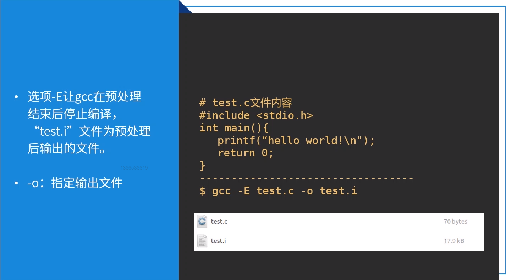
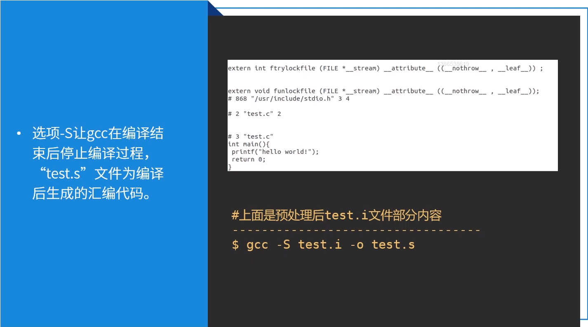
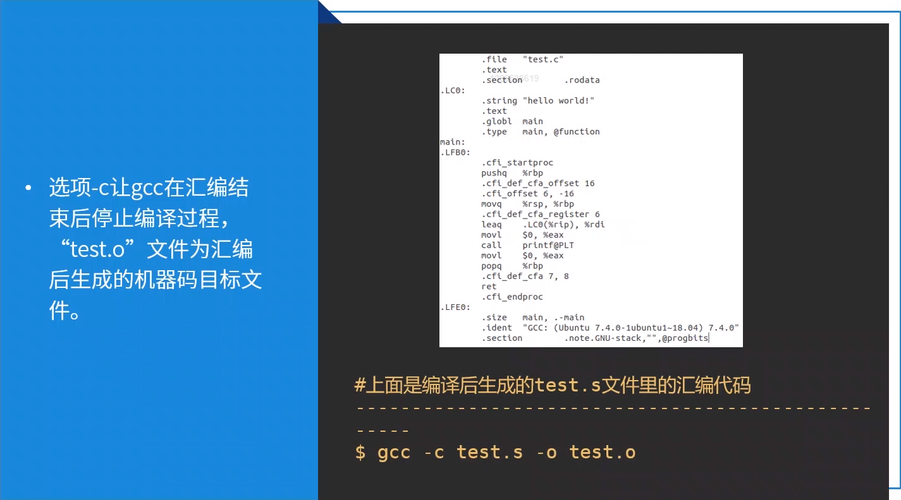
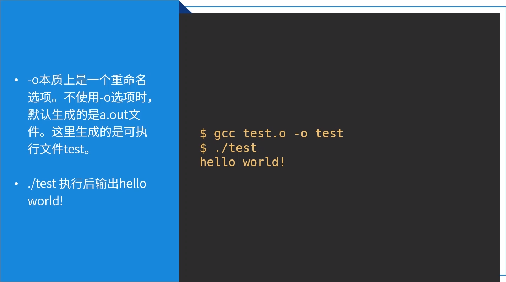
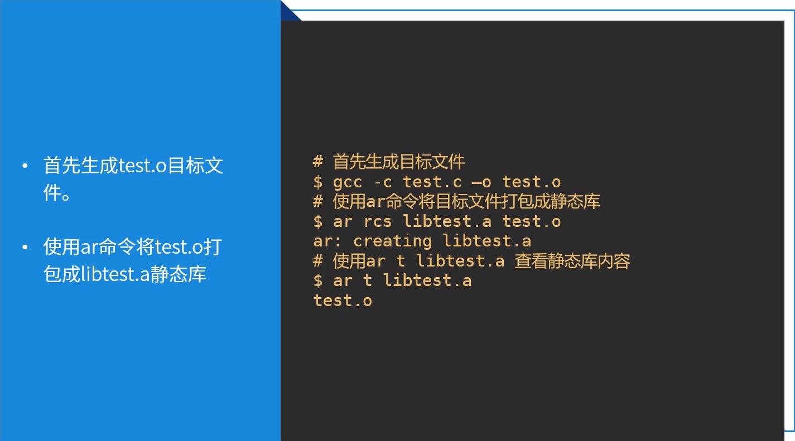
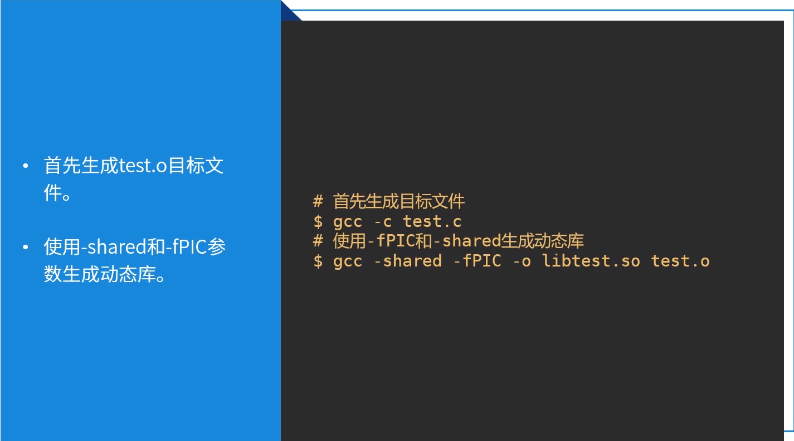

## 静态库与动态库原理，编译流程详解

### 编译流程

编译就是将高级语言编写的程序转换为二进制代码可执行性目标的过程。

编译分为四大过程：

- 预处理
- 编译
- 汇编
- 链接

#### 预处理

- 完成宏替换、文件引入，以及去除空行、注释等，为下一步的编译做准备。
- 也就是对各种预处理命令进行处理，包含头文件的包含、宏定义的扩展、条件编译的选择等。

#### 编译

- 将预处理后的代码编译成汇编代码。这个阶段中，首先要检查代码的规范性、是否有语法错误等，以确定代码实际要做的工作，在检查无误后，在把代码翻译成汇编语言。
- 编译程序执行时，先分析，后综合。分析，就是指词法分析、语法分析、语义分析和中间代码生成。综合，就是指代码优化和代码生成。
- 大多数的编译程序直接产生机器语言的目标代码，形成可执行的目标文件，也有的是先产生汇编语言一级的符号代码文件，在调用汇编程序进行翻译和加工处理，最后产生可执行的机器语言目标文件。

#### 汇编

- 汇编就是把编译阶段生成的 “.s” 文件转成二进制目标代码，也就是既期待吗(01序列)

#### 链接

- 链接就是将多个目标文件以及所需的库文件链接生成可执行目标文件的过程。

### 静态库

- 静态库实际就是一些目标文件（一般以 .o 结尾）的集合，静态库一般以 .a 结尾，只用于生成可执行文件阶段。
- 在链接步骤中，链接器将从库文件取得所需代码，复制到生成的可执行文件中。这种库称为静态库。其特点是可执行文件中包含了库代码的一份完整拷贝，在编译过程中被载入程序中。缺点就是多次使用就会有多份冗余拷贝，并且对程序的更新、部署和发布会带来麻烦，如果静态库有更新，那么所有使用它的程序都需要重新编译、发布。

> 选项 rcs ：
>
> r：更新或增加新文件到静态库中。
> c：创建一个库，不管存在与否。
> s：创建文档索引，这在创建较大的库时，能加快编译时间

### 动态库

- 动态库在链接阶段没有被复制到程序中，而是在程序运行时有系统动态加载到内存中供程序调用。
- 系统只需载入一次动态库，不同的程序可以得到内存中相同的动态库的副本，因此节省了很多内存。

> -fPIC：创建与地址无关的代码，以供生成动态库使用。

### 静态库与动态库的区别

**载入时刻不同：**

- 静态库在程序编译时会链接到目标代码中，程序运行时不再需要静态库，因此体积较大。而且每次编译都需要载入静态代码，因此内存开销大。
- 动态库在程序编译时不会被链接到目标代码中，而是在程序运行时才被载入，程序运行时需要动态库存在，因此体积较小。而且系统只需要载入一次动态库，不同程序可以得到内存中相同的动态库副本，因此内存开销小。